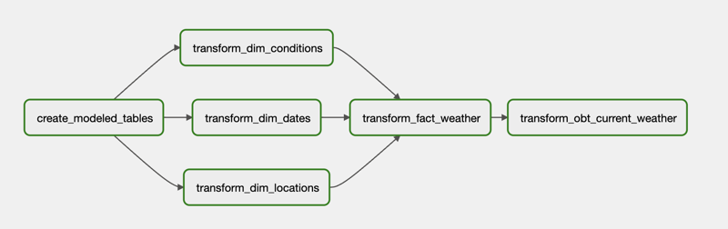

# Bungalow Take Home Project for Data Engineer Role (V2. 2021-11-02)

### Time spent

This project was worked upon over the course of a day intermixed with other external projects. There was some time spent on review of the OpenWeatherMap API documentation as well as the "Running Airflow in Docker" quick start to identify some configuration changes from the default.

### Assumptions

Assumed only primary weather condition was relevant for stakeholders. The OpenWeatherMap API docs states that "it is possible to meet more than one weather condition for a requested location. The first weather condition in API respond is primary".
  * If additional conditions required, would consider concatenating conditions or modifying ingestion to support multiple conditions.

For simplicity, also assumed only current weather for 5 cities was required and that this was a stable count. This was assumed as the current weather APIs supporting multiple cities is being deprecated as of January 1, 2022.
  * To support 5 cities, dynamic DAGs were used but this is generally only appropriate for a stable group of cities. If list of cities was constantly evolving or there were hundreds required, would look to modify pipeline to use batch API requests and parallel data loads.
  * Upon OpenWeatherMap docs review, there were some bulk datasets available which may be more appropriate for ingestion, but continued with design of a piecemeal data pipeline to allow constant ingestion of current weather data

### Pipeline summary
#### Fetcher

* `ingest_api_data`: dynamic tasks for ingesting current weather API and storing responses to raw file store
* `create_raw_dataset`: create schema for raw data layer in database
* `load_raw_dataset`: retrieve raw files, clean, normalize and upsert load into database

#### Transformer

* `create_modeled_tables`: create schema for dimensional tables (star schema) and materialized one-big-table (obt)
* `transform_dim_<table>`: load data into dimension tables
* `transform_fact_weather`: load data into fact table
* `transform_obt_current_weather`: materialize data into one big table (obt)

#### Analytics

* To support general analytical queries, raw data was loaded into a dimensional model (star schema)
  * Dimensions: dates, location, conditions
  * Fact: weather measurements
* To support possible performant analytical queries on a future columnar database (Redshift/BigQuery), data can also be materialized into one-big-table (obt)

#### Example Queries

Observed min and max pressure by location and month
```
SELECT
    d.month_name, d.year, l.name, min(w.pressure) AS min_pressure, max(w.pressure) AS max_pressure
FROM
    fact_weather w
INNER JOIN
    dim_dates d ON w.date_key = d.date_key
INNER JOIN
    dim_locations l ON w.location_key = l.location_key
GROUP BY
    d.month_name, d.year, l.name;
```

Record ingestion validation check - can compare versus daily threshold
```
SELECT 
    location_name, date, COUNT(1) as records
FROM 
    obt_current_weather 
GROUP BY 
    location_name, date;
```

### Next steps

With more time, following pipeline improvements could be made:
* For checking API or file availability – could add `HttpSensor` (API) or `FileSensor` into DAGs
* For notifications to external stakeholders, could add success/failure alerting via `SlackAPIPostOperator`
* Add validation for cities list to ensure successful API response
* Add unit tests for pipeline functions and coverage analysis
* Update upsert handling on database loads to be more atomic
* Update load/transform pipeline to be more incremental rather than current truncate and replace
* Review usage of batched API calls rather than piecemeal calls
* Review for further data cleansing and edge cases errors: schema evolution, missing values

If pipeline was to be deployed on cloud infrastructure, would review following:
* Moving management of database transforms from `PostgresOperator` tasks to a framework like `dbt` for improved quality checks and templating
* Decouple Python processing scripts from DAGs, would deploy processing scripts and their dependencies into a Docker image
  * Airflow could then execute containerized processing tasks using `ECSOperator` or `KubernetesPodOperator` with different entry points
* Move Airflow and raw file store to cloud using managed services like MWAA/Composer and S3/Cloud Storage
* Move project configuration to a parameter or secrets store
* Review deployment plan including CI/CD workflows and infrastructure configuration using Terraform/CloudFormation

### Instructions to the evaluator

* Per project instructions, assume Docker Compose has been installed
  * Changes were made to default `docker-compose.yaml` to hide demo DAGs and set Airflow Postgres as default for `PostgresOperator`

* Generate developer API key for OpenWeatherMap API and update `OPEN_WEATHER_API_KEY` in `dags/pipeline/config.py`
* Run `make init` to initialize  project via docker compose
* Run `make start` to start project
* Enable `fetcher` and `transformer` DAGs via Airflow UI to start data pipelines
